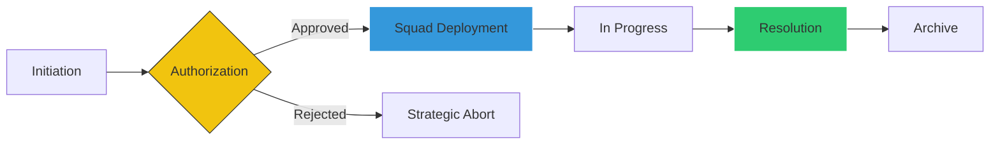
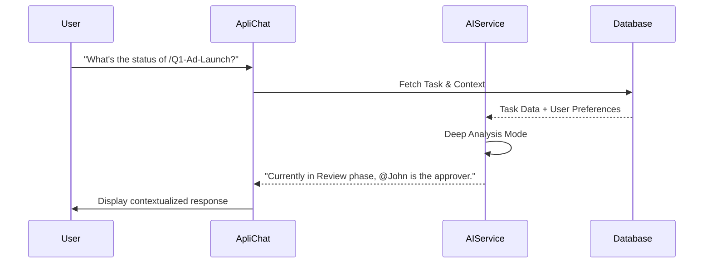

# 🚀 Apli Unified Platform: The Intelligent Enterprise Nerve Center

## 🌟 Executive Summary

### The Vision
The **Apli Unified Platform** is a high-performance orchestration engine designed to unify diverse departments—from Technical Operations and HR to Marketing and Finance—into a single, data-driven ecosystem. It leverages cutting-edge AI and deep third-party integrations to eliminate silos and drive operational velocity.

### The Problem
*   **Operational Silos**: Departments use separate tools (Ticketing, Tasks, Calendars), leading to data fragmentation.
*   **Meeting Waste**: Key decisions discussed in Teams meetings are often lost or forgotten without manual notes.
*   **Approval Bottlenecks**: Complex inter-departmental requests often stall without clear escalation paths.
*   **Generic Intelligence**: Standard AI lack access to organization-specific context, transcripts, and history.

### The Solution: Apli's Tactical Advantage
1.  **Cross-Departmental Synergy**: A unified interface for Tasks, Tickets, and Strategic Goals across the entire organization.
2.  **Deep Microsoft Integration**: 100% resolution of Teams meetings, including automated transcription and AI-driven summarization.
3.  **Human-Centric AI**: ApliChat, a persistent learning companion that understands your role, your meetings, and your business context.
4.  **Strategic Alignment**: Integrated OKR (Objectives and Key Results) tracking tied to daily execution.

---

## 🎟️ Advanced Tactical Ticketing System

Designed for cross-departmental collaboration, our ticketing system moves beyond simple "support" into a **Tactical Squad Deployment** model.

### 🔄 The Ticket Lifecycle

### Key Ticketing Features:
*   **Multi-Role Authorization**: Tickets can require Managerial Authorization from the receiver department before activation.
*   **Squad Assignments**: Managers can deploy specific "Tactical Squads" (multiple workers) to a single ticket.
*   **Inter-Departmental Handshakes**: Seamlessly transfer tickets between departments (e.g., Marketing requesting a technical integration from Tech).
*   **ApliChat Visibility**: ApliChat can reference tickets using `/TKT-1001` or @mentioning users to see their active involvements.

---

## 📞 Microsoft Synchronisation & Meeting Intelligence

Apli features an authoritative bridge to the Microsoft Graph API, transforming "meetings" into "actionable intelligence."

### 🧠 The Meeting-to-Task Pipeline
Apli doesn't just sync your calendar; it extracts value from every minute.

### Advanced Tech Spec:
*   **Authoritative Transcript Resolution**: Uses a multi-strategy approach (v1.0, Beta, and direct OneDrive VTT parsing) to guarantee 100% transcript availability.
*   **AI-Generated Summaries**: Automatically distills hour-long transcripts into action points and key decisions.
*   **Meeting Detail Visuals**: Dedicated pages for transcripts, attendee status, and AI analysis.

---

## 🧠 ApliChat: The Nexus of Intelligence

ApliChat is the central interface for all operational queries. It interacts with three core data dimensions:

1.  **Tasks & Workflows**: Reference any task with `/task-name`.
2.  **Tactical Tickets**: Query and manage tickets with `/TKT-xxx`.
3.  **Meeting Intelligence**: Recall decisions from Teams transcripts.

### Persistent Context Learning
ApliChat builds a **User Context Profile**. If you tell it you prefer "Detailed Summaries" or you are "Focused on the Q2 Product Launch," it remembers this across sessions and across different entities.

---

## 🎯 OKRs & Strategic Quarters

Apli aligns daily "grind" with quarterly "grand strategy."
*   **Velocity Hub**: A dedicated dashboard for tracking **Strategy Velocity**—showing the progress of Objectives compared to Task/Ticket completion.
*   **Quarterly Planning**: Every entity is tagged with a "Quarter" (e.g., 2024-Q1) to track momentum over time.
*   **Average Progress**: Real-time percentage of objective completion based on subtask resolution.

---

## 📊 Analytics, Gamification & Atmosphere

### 🏆 The Performance Elite (Leaderboard)
The platform incentivizes excellence through a real-time leaderboard. Users are ranked based on **Resolution Success** (completed Tasks and Tickets).
*   **Identity Tiers**: Top 3 performers receive special badges and visual treatment.
*   **Global Competition**: Fosters healthy productivity across the entire company.

### 🌤️ Atmospheric Synchronisation (Weather Connectivity)
The dashboard is location-aware. It uses the user's geographic coordinates to sync the "Operational Atmosphere."
*   **Dynamic Greetings**: Adaptive greetings based on local time and weather (e.g., SunIcon for clear skies, CloudIcon for overcast).
*   **Psychological Comfort**: Makes the digital workplace feel connected to the real world.

---

## 🛤️ Premium User Journeys

### Journey 1: The "Teams to Ticket" Workflow
1.  **The Meeting**: A Project Manager holds a Teams meeting.
2.  **The Sync**: Apli automatically fetches the transcript and summarizes it.
3.  **The Action**: PM reads the summary, identifies a bug, and immediately creates a **Tactical Ticket** for the Dev team.
4.  **The Squad**: Dev Manager approves the incoming request and deploys a squad.

### Journey 2: The "Strategic Employee"
1.  **Morning Sync**: Employee logs in, sees "Good Morning," 24°C, and their current **Elite Rank** (Leaderboard).
2.  **Context Load**: Employee asks ApliChat: *"What are my priorities for this Quarter's objectives?"*
3.  **Execution**: ApliChat scans active OKRs and assigned Tasks, suggesting a roadmap for the day.

---

## ✅ The Apli Advantage
Apli Unified Platform is the **single source of truth** for your organization. By merging Microsoft productivity with AI memory and cross-departmental workflows, it provides:
*   **100% Visibility** into every department.
*   **Automated Intelligence** from every meeting.
*   **Gamified Productivity** for every employee.

**The future of work is not just managed—it's Unified.**
