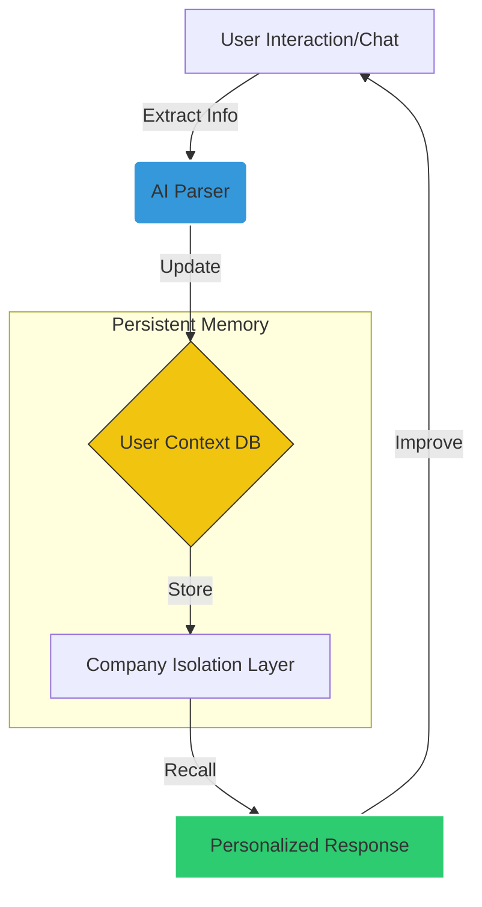
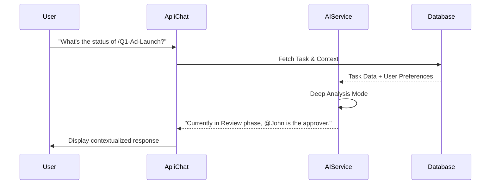

# 🚀 Apliman: The AI-Powered Marketing Task Management Ecosystem

## 🌟 Executive Summary

### The Vision
Apliman is not just another task management tool; it is an **Intelligent Operations Platform** designed specifically for marketing teams and agencies. It bridges the gap between chaotic creative workflows and structured project management through a proprietary **AI Learning Engine**.

### The Problem
*   **Context Loss**: Important project details are often buried in long email threads or chat apps.
*   **Manual Overhead**: Creating tasks, defining subtasks, and checking for completeness takes away from creative time.
*   **Cold AI**: Generic AI tools don't know your business context, your team's roles, or your specific marketing domain.

### The Solution
Apliman solves these problems by providing:
1.  **Persistent AI Memory**: An AI that learns who you are, what you do, and how your company works.
2.  **Automated Workflows**: Dynamic, role-based phases that guide tasks from planning to publication.
3.  **Integrated Business Intel**: Seamlessly blends internal company knowledge with competitor insights.

---

## 🏗️ Core Feature Ecosystem

### 1. Role-Based Access Control (RBAC)
Apliman ensures data security and operational clarity through a strict hierarchy:
*   **Super Admin**: Global configuration and cross-company management.
*   **Admin**: Departmental oversight, workflow creation, and approval management.
*   **Employee**: Task execution, collaboration, and personal performance tracking.
*   **Retired**: Read-only archival access for compliance and history.

### 2. The Dynamic Workflow Engine
Workflows are the backbone of Apliman. Unlike static lists, our workflows are stateful:
*   **Custom Phases**: Planning → Design → Review → Approval → Published.
*   **Auto-assignment**: Smartly routes tasks to the right specialist when a phase changes.
*   **Quality Gates**: Certain phases require mandatory Admin approval before progression.

### 3. Comprehensive Task Management
*   **Smart Creation**: AI-assisted title, description, and goal generation.
*   **Automatic Subtasks**: AI analyzes the main task and breaks it down into actionable steps.
*   **Multimodal Attachments**: Full support for documents and images with automatic optimization.

---

## 🧠 The AI "Brain" - How It Works

The platform's intelligence is powered by a specialized AI Service that implements **Company-Isolated Learning**.

### The Learning Loop
Our AI doesn't just process text; it builds a **User Context Profile** from every interaction.

### Key AI Features:
*   **Task Summarization**: Instantly distills complex documents into concise summaries.
*   **Priority Analysis**: Suggests priority based on deadlines, complexity, and team workload.
*   **Completeness Checking**: Validates if a task has all necessary info before it's sent for review.

---

## 💬 ApliChat: The Intelligence Hub

ApliChat is the terminal through which users interact with the system's "Brain."

### Advanced Interaction Logic
*   **@Mentions**: Directly query information about team members (e.g., *"What is @Sarah's workload today?"*).
*   **Task References**: Use `/` to bring task context into the conversation (e.g., *"Summarize /Marketing-Campaign-Q1"*).
*   **Knowledge Scraping**: AI scrapes official company documents and competitor sites to provide contextually rich answers.

---

## 📊 Analytics & Strategic Insights

Apliman provides a 360-degree view of your marketing operations:
*   **Dashboard Analytics**: Real-time task distribution and completion trends.
*   **Team Performance**: Compare productivity across departments without micromanagement.
*   **AI Productivity Insights**: AI analyzes bottlenecks in workflows and suggests process improvements.

---

## 🛣️ User Journey Highlights

### Journey 1: The Manager (Planning & Oversight)
1.  **Define Workflow**: Admin creates a "Video Production" workflow with custom phases.
2.  **AI Creation**: Admin types "Launch Video" and clicks *Generate*. AI fills in high-level goals.
3.  **Auto-Assignment**: System automatically assigns the "Design" phase to the lead animator.
4.  **Approval Flow**: Admin receives a notification for review once the task hits the "Approval" phase.

### Journey 2: The Creative (Execution & Collaboration)
1.  **Dashboard Start**: Employee sees current tasks and "Late" tags for urgent items.
2.  **AI Subtasks**: Employee opens a new task and finds AI-generated steps already listed.
3.  **Collaboration**: Employee mentions @Admin in a comment to clarify a goal.
4.  **ApliChat Assistance**: Employee asks ApliChat to summarize the complex client brief attached to the task.

---

## 🏢 Who Benefits from Apliman?

### Target Companies
*   **Creative Agencies**: Managing multiple clients with distinct workflows.
*   **Internal Marketing Departments**: Needing to align social media, SEO, and content teams.
*   **SaaS Marketing Teams**: Scaling fast with high task volume and complex integrations.
*   **Any Tech-Forward Enterprise**: Looking to leverage AI to reduce administrative friction.

---

## ⚙️ Modern Technology Stack
*   **Frontend**: React 18, TypeScript, TailwindCSS, Framer Motion (Animations).
*   **Backend**: NestJS, PostgreSQL (Prisma ORM), Socket.io (Real-time).
*   **AI Service**: Python (FastAPI), Google Gemini / Hugging Face Transformers.

---

## ✅ Conclusion
Apliman is designed to be the **last task management system** a marketing company will ever need. By integrating deep AI learning with a robust workflow engine, it doesn't just track work—it helps **do the work**.

**Interested in a live demo?**  
Let's connect to show you how Apliman can transform your team's productivity.
