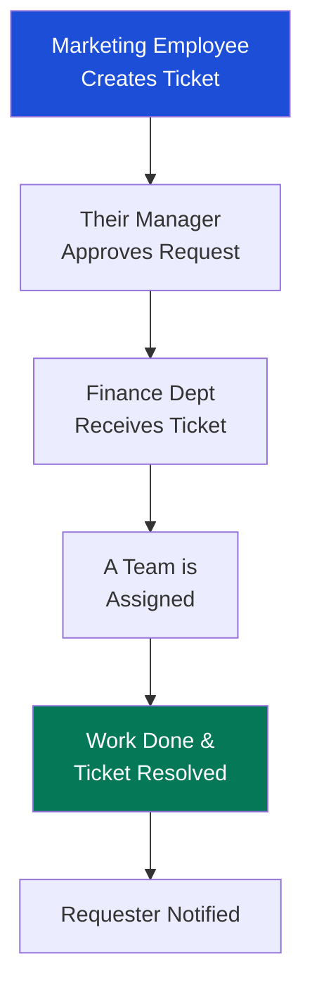
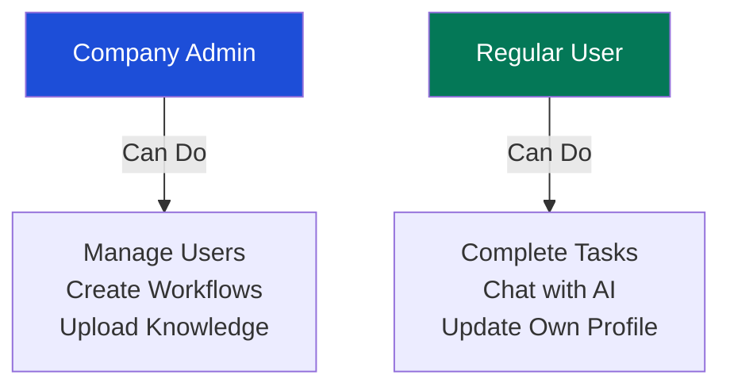

# Aura Operations - Business & Operational Guide

> **Making Intelligent Work Simple**
> *A comprehensive guide to everything Aura Operations can do for your organisation.*

---

## Welcome to Aura Operations

**Aura Operations** is more than just a task manager; it is the "Central Brain" of your organisation. It brings every department - Marketing, Finance, Tech, HR, and Operations - into one shared space where AI helps you plan, Microsoft Teams helps you capture knowledge, and transparent workflows ensure nothing ever gets lost.

This guide explains every feature of the platform in plain language, focusing on how it helps your team stay productive and aligned.

---

## 1. Your Private Organisation (Isolated Workspaces)

**The Concept**: Think of Aura Operations as a secure building. Your organisation has its own private floor. No one from outside can see your files, your chat history, or your tasks. Even the AI is trained specifically on *your* company.

**Business Benefit**: Total data security and privacy. You get the power of a global platform with the privacy of a custom-built internal system.

---

## 2. Managing Work: The Workflow Engine

**The Concept**: Instead of a simple "To-Do" list, Aura Operations uses **Workflows**. A workflow is the specific journey a task takes from start to finish. For example, a "Video Production" workflow goes from *Scripting* to *Editing* to *Approval*.

**Activity Diagram: The Journey of a Task**

**Business Benefit**: You can see exactly where work is stuck. If a video is in "Editing" for 10 days, the system flags it automatically.

### Team Collaboration
Aura Operations turns every task into a **Communication Hub**. Employees can:
- **@Mention** colleagues to get their attention.
- **Upload Files**: Share images, documents, and videos directly within the task chat.
- **Real-time Chat**: Discuss project details right where the work happens.

---

## 3. High-Speed Planning (AI Task Power)

**The Concept**: Writing detailed task briefs takes time. In Aura Operations, you just type a title (e.g., "Launch Summer Campaign") and click **Generate**. The AI reads your company’s internal guides and writes the full description, goals, and even breaks it down into a checklist of subtasks.

**Smart Assignment**: The system isn't just creating a list; it automatically identifies which team members should handle which subtask by matching the work to their **specific job position**.

**Business Benefit**: Managers save hours of manual writing. Tasks are clearer, and the right people are automatically pulled into the project based on their expertise.

---

## 4. The Digital Postman (Cross-Department Ticketing)

**The Concept**: When Marketing needs something from Finance, they don't send an email that might get buried. They open a **Ticket**. This is a formal request that travels between departments.

**Activity Diagram: Requesting Help**

**Business Benefit**: Every internal request is tracked. You can see how long it takes for HR to help Technology, or for Design to help Marketing.

---

## 5. Capturing Every Meeting (Microsoft Teams Sync)

**The Concept**: We all spend hours in meetings and forget the details. Aura Operations connects to your Microsoft Teams. After your meeting ends, Aura Operations automatically fetches the transcript, identifies who spoke, and provides a short AI summary of the decisions made.

**Business Benefit**: No more "What did we decide?" questions. Every meeting becomes a searchable piece of company intelligence.

---

## 6. AuraChat: The Assistant That Knows You

**The Concept**: AuraChat is like a smart assistant sitting on your shoulder. Because it is connected to your tasks, your meetings, and your company documents, you can ask it specific questions.

**What you can ask:**
- "What did Sarah mention in yesterday's meeting about the budget?"
- "Summarize the /Q2-Marketing-Task for me."
- "Based on my current workload, what should I focus on today?"

**Smart Shortcuts**:
- **@** to mention an **Employee**.
- **#** to reference a **Ticket**.
- **/** to mention a specific **Task**.

**Business Benefit**: Instant answers and seamless navigation without searching through files or emails.

---

## 7. Connecting Work to Vision (OKRs)

**The Concept**: **OKRs** (Objectives and Key Results) are your "Big Goals." You might have a goal to "Increase Customer Satisfaction by 20%." Aura Operations lets you track this goal and see which daily tasks are helping you reach it.

**Business Benefit**: Every employee understands *why* they are doing their work and how it contributes to the company's success.

---

## 8. Dashboard & Analytics: The Vitals

**The Concept**: The Dashboard is your "Mission Control." At a glance, you see:
- **Leaderboard**: Who is completing the most work this week (friendly competition).
- **Weather**: A personal touch showing the conditions at your current location.
- **KPIs**: How many tasks are late, how many are done, and overall team health.

**Business Benefit**: Leadership can make data-driven decisions instead of guessing based on "vibes."

---

## 9. Mission Control (The Unified Calendar)

**The Concept**: Most people have a calendar for meetings and a list for tasks. Aura Operations merges them. You see your Microsoft meetings, your due tasks, and your ticket deadlines all on one screen.

**Business Benefit**: better time management. You can see if you have a 3-hour meeting the same day a major task is due.

---

## 10. Personnel & Organization: The Team Map

**The Concept**: Aura Operations keeps a live map of your team. You can see who is online, what department they are in, and what their role is. It also allows you to organize people into "Teams" (like the "Social Media Squad") which might span across multiple departments.

**Activity Diagram: Role Differences**

**Business Benefit**: Clear structure and security. Everyone knows their lane, and sensitive settings are protected.

---

## 11. Custom Knowledge (The Company Brain)

**The Concept**: You can upload your company’s PDFs, handbooks, or website links into the "Knowledge Base." The AI reads these and uses them to give you better answers. It's like having an expert who has read every single document in your office.

**Business Benefit**: New employees get up to speed faster, and AI answers are always "on-brand."

---

## 12. Management for Owners (Super Admin)

**The Concept**: This is for the person who owns the entire platform. They can see all the different companies using Aura Operations, manage their subscription plans (Free/Pro), and turn AI on or off with one button.

**Business Benefit**: Scalability. One system can support thousands of teams while keeping them all perfectly separated.

---

### Summary: Why Aura Operations?

| Feature | In Simple Terms |
|---|---|
| **Workflows** | A clear "road map" for every project. |
| **AI Generation** | One-click expert planning. |
| **Teams Sync** | Your meetings, remembered and summarized. |
| **AuraChat** | An assistant that actually knows your work. |
| **Ticketing** | A formal, trackable "Help Desk" for every department. |
| **Calendar** | Your entire day (meetings + work) in one view. |

---

*This guide was designed to help non-technical stakeholders understand the immense value and simplicity Aura Operations brings to the modern workplace.*
