# Aura Operations - Complete Feature Reference

> **April 2026**
> *Confidential - For Internal Review Only*

---

## Table of Contents

1. [Executive Overview](#1-executive-overview)
2. [System Architecture](#2-system-architecture)
3. [Multi-Tenancy & Role-Based Access Control](#3-multi-tenancy--role-based-access-control)
4. [Dynamic Workflow Engine](#4-dynamic-workflow-engine)
5. [AI-Powered Task Generation](#5-ai-powered-task-generation)
6. [Task Management Deep Dive](#6-task-management-deep-dive)
7. [Cross-Departmental Ticketing System](#7-cross-departmental-ticketing-system)
8. [Microsoft Teams Sync & Meeting Intelligence](#8-microsoft-teams-sync--meeting-intelligence)
9. [AuraChat - The Intelligence Hub](#9-aplichat--the-intelligence-hub)
10. [Strategic Objectives & OKRs](#10-strategic-objectives--okrs)
11. [Analytics & Executive Dashboard](#11-analytics--executive-dashboard)
12. [Performance Leaderboard](#12-performance-leaderboard)
13. [Location-Aware Weather](#13-location-aware-weather)
14. [Knowledge Sources Engine](#14-knowledge-sources-engine)
15. [Real-Time Presence & Notifications](#15-real-time-presence--notifications)
16. [Security & Data Isolation](#16-security--data-isolation)
17. [Target Industries & Use Cases](#17-target-industries--use-cases)
18. [Technology Stack](#18-technology-stack)
19. [Unified Calendar & Planning](#19-unified-calendar--planning)
20. [Personnel & Identity Hub](#20-personnel--identity-hub)
21. [Personalize, Profile & Activity Tracks](#21-personalize-profile--activity-tracks)
22. [Platform Super Administration (SaaS Governance)](#22-platform-super-administration-saas-governance)

---

## 1. Executive Overview

### What is Aura Operations?

**Aura Operations** is an intelligent enterprise operations platform that unifies work across every department - from Technology and Finance to HR, Marketing, and Operations - under a single, AI-augmented workspace. It is not built around one team or one workflow; it is built around the **entire organisation**.

The platform serves multiple client organisations simultaneously under a multi-tenant architecture. Each organisation operates in a fully isolated environment with its own users, data, AI context, and security boundaries.

### The Problem Aura Operations Solves

| Pain Point | Impact | Aura Operations's Answer |
|---|---|---|
| Siloed departmental tools | Teams cannot collaborate; data is fragmented | Unified workspace with cross-departmental tickets and tasks |
| Meeting content is lost | Decisions exist only in memory | Automated transcript extraction and AI summarisation |
| Generic AI tools | AI does not know your company or context | Organisation-isolated AI with persistent memory |
| No strategic alignment | Daily tasks disconnected from company goals | OKR system tied to quarterly objectives and tasks |
| Manual task creation | Managers spend hours writing descriptions | One-click AI generation of description, goals, and subtasks |
| Approval bottlenecks | Inter-departmental requests stall | Formalised ticket system with staged authorisation |
| No cross-team visibility | Leadership cannot see operational health | Live analytics dashboard with leaderboard and KPIs |

### Who Benefits?

- **Enterprises with multiple departments** that need unified operations
- **Creative and consulting agencies** managing complex client workflows
- **Technology companies** with Engineering, Product, and Marketing running in parallel
- **Financial and professional services** requiring formal approval chains
- **Any organisation using Microsoft Teams** that wants to extract intelligence from meetings

---

## 2. System Architecture

The platform is composed of three independent, horizontally-scalable services that form a coherent operational layer.

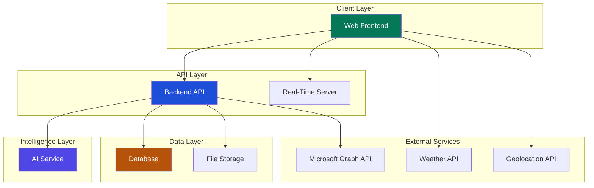

### Service Responsibilities

| Service | Technology | Purpose |
|---|---|---|
| **Frontend** | React 18, TypeScript, Vite, TailwindCSS | User interface, real-time updates, state management |
| **Backend API** | NestJS, TypeScript, Prisma ORM, Socket.IO | Business logic, authentication, data access, integrations |
| **AI Service** | Python, FastAPI, large language model provider | Task generation, chat, summarisation, analysis |
| **Database** | PostgreSQL | All persistent data, multi-tenant isolation |

---

## 3. Multi-Tenancy & Role-Based Access Control

### Multi-Tenant Architecture

Aura Operations is a **multi-tenant SaaS platform**. Each client organisation (tenant) is completely isolated - their users, tasks, tickets, AI context, and knowledge sources are never shared with other organisations.

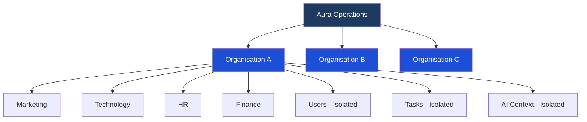

### Role Hierarchy

The platform enforces a four-tier role hierarchy within each organisation:

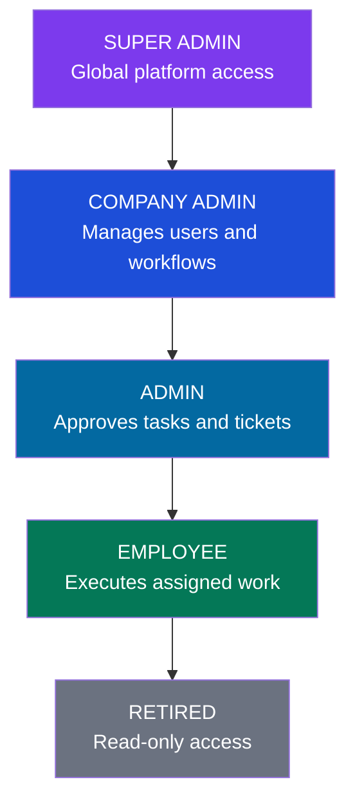

#### Strategy Access Layer

Beyond the standard role hierarchy, certain non-admin users can be granted **Strategy Access** - a granular permission to view or edit OKRs without a full Admin promotion.

States: `NONE` -> `VIEW` -> `EDIT`

### Administrative vs Operational Responsibilities

Aura Operations clearly defines the boundary between those who manage the organisation and those who drive its daily operations.

| Capability | Company Admin | Regular User |
|---|---|---|
| **Work Execution** | Yes (Tasks, Tickets, Chat) | Yes (Tasks, Tickets, Chat) |
| **System Identity** | Create/Update/Delete Users | View own profile only |
| **Org Structure** | Create Departments & Teams | View assigned units |
| **AI Governance** | Configure Knowledge Sources | Access personal context |
| **Workflow Design** | Create & Modify Workflows | Execute work within phases |
| **Strategy Control** | Create Quarters & Objectives | Requires special grant |
| **Operational Oversight** | Company-wide Audit & Analytics | Personal/Squad analytics only |
| **Account Security** | Reset user passwords | Change own password |

---

## 4. Dynamic Workflow Engine

Workflows are the operational backbone of the task system. Aura Operations workflows are **stateful machines** that route work automatically through defined stages.

### Core Concepts

- **Workflow**: A named process template with a colour code and ordered phases (e.g., "Video Production Workflow").
- **Phase**: A stage within a workflow (e.g., Scripting -> Filming -> Editing -> QA -> Published).
- **Start Phase / End Phase**: Markers defining the entry and exit points of a workflow.
- **Auto-Assignment**: Each phase specifies which user is assigned when a task enters it.

### Workflow Lifecycle

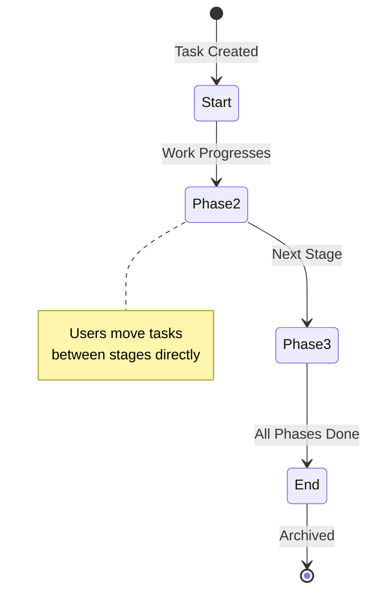

---

## 5. AI-Powered Task Generation

Instead of forcing managers to write lengthy task descriptions, the integrated AI engine generates content using the organisation's own knowledge base as context.

### The AI Generation Pipeline

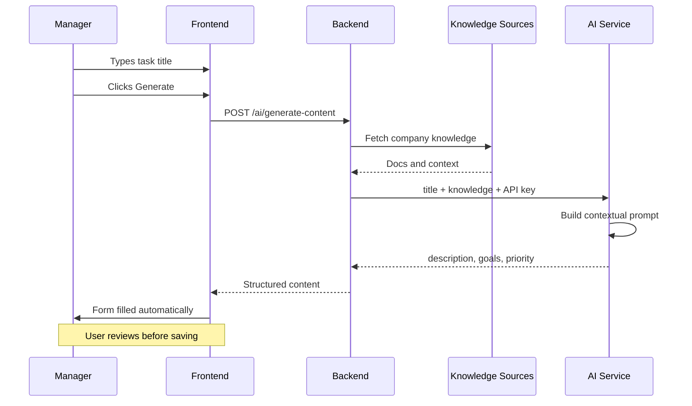

### What the AI Generates Per Task

| Field | How It Is Generated |
|---|---|
| **Description** | Detailed prose written in the company's voice using knowledge sources |
| **Goals & Criteria** | Numbered list of measurable outcomes and success markers |
| **Priority Score (1-5)** | Analyses title complexity and urgency signals |
| **Task Type** | Auto-detects Marketing, Design, Technical, General, etc. |
| **Subtask Assignment** | Decomposes task and **assigns to employees based on their job position** |

### Auto-Generated Subtasks

After a task is created, the AI automatically decomposes it into an actionable subtask list:

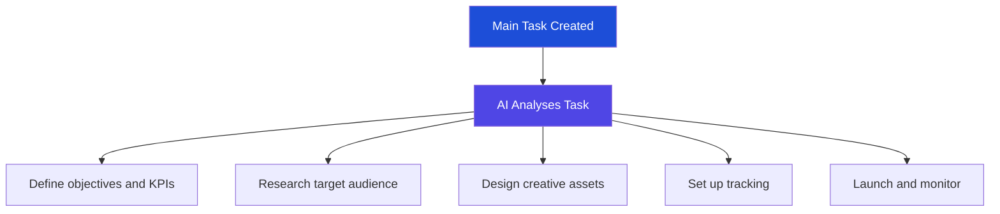

---

## 6. Task Management Deep Dive

### The Task Data Model

```
Task {
  title, description, goals        - Core content
  workflow, currentPhase           - Workflow position
  taskType                         - Category
  priority (1-5)                   - Low to Critical
  dueDate, completedAt             - Time tracking
  assignedTo, createdBy            - Ownership
  subtasks[]                       - Individual checklist items assigned to roles
  attachments[]                    - File uploads and shared assets
  comments[]                       - Real-time chat thread with @mentions
  isLate                           - Flagged past due date
}

### Collaboration & Interaction
The task system serves as a communication hub. Employees assigned to a task can:
- **@Mention** team members to trigger instant notifications.
- **Share Files**: Upload images, documents, and videos directly into the task chat.
- **Live Thread**: Participate in a persistent discussion thread specific to that task's scope.
```

### Task Creation Journey

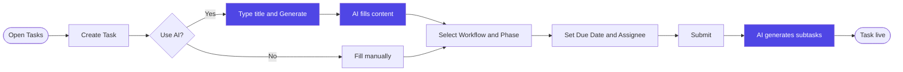

---

## 7. Cross-Departmental Ticketing System

The ticketing system is a formalised **inter-departmental engagement engine** - enabling any department to formally request services, collaboration, or resources from any other department.

### The Ticket Data Model

```
Ticket {
  ticketNumber (TKT-XXXX)         - Auto-generated ID
  title, description               - Engagement scope
  type (GENERAL, FINANCIAL, etc.)  - Category
  priority (LOW to CRITICAL)       - Urgency
  status                           - See lifecycle below
  requester                        - Originating party
  receiverDept                     - Receiving department
  receiverManager                  - Approving authority (Dept Manager)
  assignments[]                    - The "Squad" assigned to the work
  comments[], attachments[]        - Collaboration layer
  deadline, amount, providerName   - Logistics fields
  requiresApproval                 - Authorization gate toggle
}
```

### The Complete Ticket Lifecycle

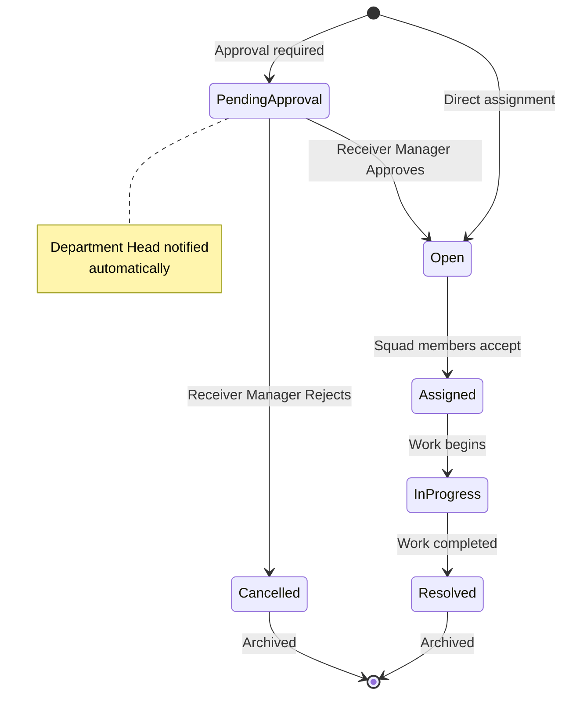

---

## 8. Microsoft Teams Sync & Meeting Intelligence

Aura Operations bridges the gap between calendar tools and the operational workspace, turning meeting recordings into **actionable intelligence**.

### Transcript Resolution - 4-Strategy Waterfall

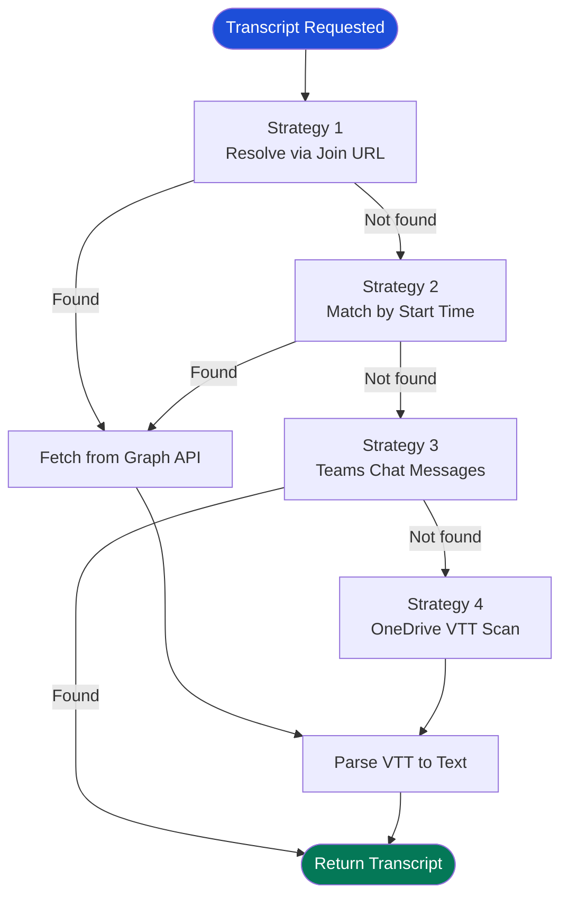

---

## 9. AuraChat - The Intelligence Hub

AuraChat is a **persistent, learning conversational assistant** that understands your role, organisation, meetings, tasks, and history.

### Intelligent Shortcuts
Both AuraChat and users can interact with the platform using simple triggers:
- **@ [Employee]**: Target a specific team member for a notification or mention.
- **# [Ticket]**: Reference a specific ticket (e.g., #TKT-1002) to pull its data into a conversation.
- **/ [Task]**: Link directly to a specific task to view status or share updates.

### The Persistent Learning System

Every conversation updates the user's **Context Profile** stored in the database:

```
UserChatContext {
  name, preferred_name
  role, department
  location
  expertise[]
  work_preference
  current_projects[]
  interests[]
}
```

---

## 10. Strategic Objectives & OKRs

Aura Operations provides a full **OKR (Objectives and Key Results)** management system, linking company goals to measurable outcomes and quarterly planning cycles.

### The OKR Data Model

```
Objective {
  title              - "Grow platform revenue by 40%"
  description        - Strategic context
  status             - ON_TRACK | AT_RISK | OFF_TRACK | COMPLETED | CANCELLED
  progress (%)       - Calculated from key results
  quarter            - e.g., Q2 2025
  keyResults[]
}
```

---

## 11. Analytics & Executive Dashboard

The analytics system gives leadership a **real-time operational picture** of the entire organisation's productivity.

### Dashboard KPI Grid

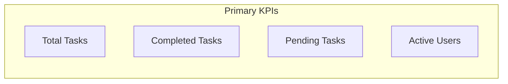

---

## 12. Performance Leaderboard

The dashboard includes a live **Performance Elite** leaderboard making productivity visible across the entire organisation.

### Ranking Algorithm

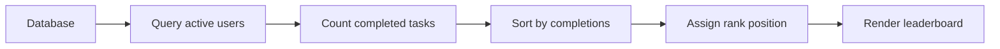

---

## 13. Location-Aware Weather

The dashboard personalises the user experience by integrating the user's **local weather** directly into the greeting banner.

| Condition | Indicator |
|---|---|
| Temperature | adaptive Celsius display |
| Above 25°C | Sun icon displayed |
| Below 25°C | Cloud icon displayed |

---

## 14. Knowledge Sources Engine

The Knowledge Sources system gives the organisation's AI a custom, authoritative **knowledge base**.

| Type | Description | Use Case |
|---|---|---|
| `TEXT` | Plain text entered manually | Company values, brand voice |
| `URL` | Scraped web pages | Public docs, competitors |
| `DOCUMENT` | Uploaded files (PDF, DOCX) | Internal guides, strategies |

---

## 15. Real-Time Presence & Notifications

### Live Presence System

The platform uses **WebSocket connections** to track and broadcast user presence in real time:

- **Login** - User appears as Online (green)
- **Inactivity** - User appears as Away (amber)
- **Logout** - User appears as Offline

---

## 16. Security & Data Isolation

| Security Layer | Implementation |
|---|---|
| **Authentication** | JWT tokens with expiry enforcement |
| **Password Storage** | bcrypt hashing |
| **Organisation Isolation** | DB query filtered by organisation ID |
| **Role Enforcement** | Guard requirements on all API endpoints |

---

## 17. Target Industries & Use Cases

| Industry | Primary Problems Solved |
|---|---|
| **Agencies** | Multi-department collaboration |
| **Tech Companies** | Ticket routing, OKR tracking |
| **Finance** | Audit-ready history, compliance |

---

## 18. Technology Stack

| Layer | Technology | Purpose |
|---|---|---|
| **Frontend** | React, TypeScript, Vite | User Interface |
| **Backend** | NestJS, Prisma, PostgreSQL | API & Database |
| **AI** | Python, FastAPI | Intelligence Service |

---

## 19. Unified Calendar & Planning

The Unified Calendar provides a consolidated operational grid where every dimension of work is visible in a single interface.

### The Unified Grid Concept

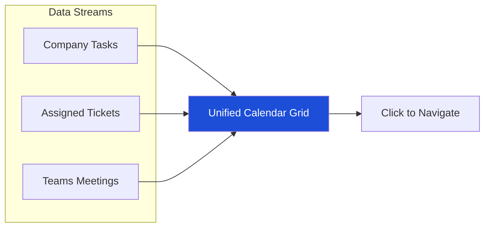

### Key Planning Features

- **WebSocket Sync**: Real-time meeting status updates reflect instantly on the grid.
- **Day Drill-Down**: Clicking any date opens a focused view showing only that day's commitments.
- **Phase Filter**: Smart dropdown showing only phases active on that specific day.

---

## 20. Personnel & Identity Hub

Aura Operations centralises all organisational identity and structure within the Personnel Hub.

### Identity Management

- **Personnel Directory**: Card grid with live presence indicators.
- **Role Visibility**: Identifies Admins, Managers, and Employees.
- **Onboarding**: Company Admins can onboard new personnel and reset credentials.

### Structural Logic: Departments vs Teams

| Unit Type | Purpose | Governance |
|---|---|---|
| **Departments** | Formal structural logs | Manager-led |
| **Teams** | Dynamic cross-functional squads | Collaborative |

---

## 21. Personalize, Profile & Activity Tracks

### User Profile Self-Service

Each user manages their own digital identity:
- **Identity Update**: Name, position, and contact details.
- **Visual Branding**: Personal avatar management.
- **Password Security**: In-app password change with validation.

### Platform Audit: The Activity Feed

The Activity Feed provides a chronological trail of meaningful events:
- Task creation, assignment, and completion.
- Comment mentions and document uploads.

---

## 22. Platform Super Administration (SaaS Governance)

Multi-tenant SaaS tools required for global governance.

### Multi-Tenant Command Centre

- **Operational Health**: Monitor users and tasks across all client organisations.
- **AI Provisioning**: Enable/disable AI features globally per company.
- **Credential Recovery**: Secure generation for company administrators.

### Subscription & Feature Limits

| Limit Type | Configurable Values |
|---|---|
| **Users** | Personnel count caps |
| **Tasks** | Global volume limits |
| **Storage** | File storage quotas in GB |
| **Intelligence** | AI feature activation toggle |

---

*Document prepared for review.*
*All architectural and feature information reflects the current production build as of April 2026.*
